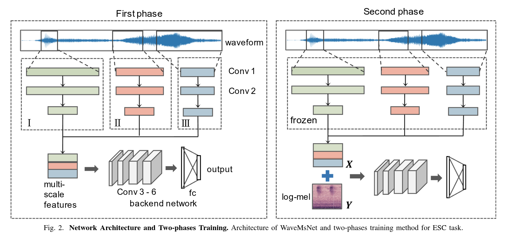

# Multi-Scale CNN for Environmental Sound Classification

## Overview
This project implements a Multi-Scale Convolutional Neural Network (MSCNN) for environmental sound classification using the ESC-50 dataset. The implementation includes a complete training pipeline with k-fold cross-validation, comprehensive model analysis, and detailed performance metrics.

## Table of Contents
1. [Architecture](#architecture)
2. [Dataset](#dataset)
3. [Implementation Details](#implementation-details)
4. [Training Process](#training-process)
5. [Evaluation and Analysis](#evaluation-and-analysis)
6. [Directory Structure](#directory-structure)
7. [Requirements](#requirements)
8. [Usage](#usage)
9. [Results and Metrics](#results-and-metrics)
10. [Notes](#notes)
11. [Visual Examples](#visual-examples)

## Architecture

### Model Structure

*Figure 1: Multi-Scale CNN Architecture showing the parallel convolutional layers and feature extraction pipeline.*

The MSCNN architecture consists of three main components:

1. **Multi-Scale Blocks**
   - Each block processes input at multiple scales (3x3, 5x5, 7x7)
   - Parallel convolutional layers with different kernel sizes
   - Batch normalization and ReLU activation
   - Output concatenation of all scales
   - Example implementation:
     ```python
     class MultiScaleBlock(nn.Module):
         def __init__(self, in_channels, out_channels):
             super().__init__()
             self.conv3 = nn.Conv2d(in_channels, out_channels, kernel_size=3, padding=1)
             self.conv5 = nn.Conv2d(in_channels, out_channels, kernel_size=5, padding=2)
             self.conv7 = nn.Conv2d(in_channels, out_channels, kernel_size=7, padding=3)
             self.bn = nn.BatchNorm2d(out_channels * 3)
             self.relu = nn.ReLU()

         def forward(self, x):
             out3 = self.conv3(x)
             out5 = self.conv5(x)
             out7 = self.conv7(x)
             out = torch.cat([out3, out5, out7], dim=1)
             out = self.bn(out)
             out = self.relu(out)
             return out
     ```

2. **Feature Extraction**
   - Three multi-scale blocks with increasing channels (32, 64, 128)
   - Max pooling between blocks
   - Global average and max pooling at the end
   - Example implementation:
     ```python
     class MSCNN(nn.Module):
         def __init__(self, num_classes=50):
             super().__init__()
             self.block1 = MultiScaleBlock(1, 32)
             self.pool1 = nn.MaxPool2d(2)
             self.block2 = MultiScaleBlock(96, 64)  # 32*3 = 96
             self.pool2 = nn.MaxPool2d(2)
             self.block3 = MultiScaleBlock(192, 128)  # 64*3 = 192
             self.pool3 = nn.MaxPool2d(2)
             self.global_avg = nn.AdaptiveAvgPool2d((1, 1))
             self.global_max = nn.AdaptiveMaxPool2d((1, 1))
             self.classifier = nn.Linear(768, num_classes)
             self.dropout = nn.Dropout(0.5)
     ```

3. **Classifier**
   - Fully connected layer with dropout
   - Output layer with 50 classes
   - Example implementation:
     ```python
     def forward(self, x):
         # Feature extraction
         x = self.block1(x)
         x = self.pool1(x)
         x = self.block2(x)
         x = self.pool2(x)
         x = self.block3(x)
         x = self.pool3(x)
         
         # Global pooling
         avg = self.global_avg(x).squeeze(-1).squeeze(-1)
         max_ = self.global_max(x).squeeze(-1).squeeze(-1)
         x = torch.cat([avg, max_], dim=1)
         
         # Classification
         x = self.dropout(x)
         out = self.classifier(x)
         return out
     ```

### Key Features
- Multi-scale feature extraction for capturing patterns at different resolutions
- Batch normalization for stable training
- Dropout for regularization
- Global pooling for spatial invariance
- Parallel processing of different kernel sizes
- Progressive increase in feature channels (32 → 64 → 128)

## Dataset

### ESC-50 Dataset
- 50 environmental sound classes
- 2,000 audio clips (40 per class)
- 5-second duration per clip
- 44.1kHz sampling rate
- 5 major categories:
  - Animals
  - Natural soundscapes
  - Human sounds
  - Interior sounds
  - Exterior sounds

### Preprocessing
1. **Audio Processing**
   - Resampling to 44.1kHz
   - Conversion to mono
   - Normalization

2. **Feature Extraction**
   - Mel spectrogram conversion
   - Log scaling
   - Normalization

3. **Data Augmentation**
   - Mixup: Linear interpolation between samples
   - Spectrogram masking: Time and frequency masking

## Implementation Details

### Training Configuration
```python
SAMPLE_RATE = 44100
N_MELS = 56
N_FFT = 2048
HOP_LENGTH = 512
BATCH_SIZE = 64
EPOCHS = 50
LEARNING_RATE = 0.001
WEIGHT_DECAY = 1e-5
MIXUP_ALPHA = 0.2
TIME_MASK_WIDTH = 20
FREQ_MASK_WIDTH = 10
N_SPLITS = 5  # Number of folds for cross-validation
```

### Data Augmentation
1. **Mixup**
   - Linear interpolation between samples
   - Alpha parameter controls mixing strength
   - Helps improve generalization

2. **Spectrogram Masking**
   - Time masking: Randomly masks time steps
   - Frequency masking: Randomly masks frequency bands
   - Simulates real-world variations

### Learning Rate Schedule
- Uses ReduceLROnPlateau scheduler
- Reduces learning rate when validation loss plateaus
- Factor: 0.5
- Patience: 5 epochs

## Training Process

### K-Fold Cross-Validation
1. **Dataset Splitting**
   - 5-fold cross-validation
   - Each fold: 80% train, 10% validation, 10% test
   - Random shuffling with fixed seed for reproducibility

2. **Training Loop**
   - For each fold:
     - Initialize new model
     - Train for specified epochs
     - Validate after each epoch
     - Save best model
     - Generate training plots

3. **Model Saving**
   - Saves model for each fold
   - Includes timestamp in filename
   - Stores in `models/` directory

### Monitoring
1. **Metrics Tracked**
   - Training loss
   - Validation loss
   - Test loss
   - Validation accuracy
   - Test accuracy
   - Learning rate

2. **Logging**
   - Detailed logs for each epoch
   - Training history saved as JSON
   - Plots saved for each fold

## Evaluation and Analysis

### Performance Metrics
1. **Overall Metrics**
   - Accuracy
   - Precision (weighted)
   - Recall (weighted)
   - F1-Score (weighted)

2. **Per-Class Metrics**
   - Precision
   - Recall
   - F1-Score
   - Support (number of samples)

### Visualizations
1. **Training Plots**
   - Loss curves (train/val/test)
   - Accuracy curves
   - Learning rate schedule

2. **Analysis Plots**
   - Confusion matrix
   - Precision-Recall curves
   - ROC curves
   - Class-wise metrics
   - Class distribution

### Cross-Validation Results
- Average metrics across folds
- Standard deviation of metrics
- Per-class performance analysis
- Comprehensive JSON report

## Directory Structure
```
.
├── models/                  # Saved model files
├── reports/
│   ├── figures/            # Training and evaluation plots
│   ├── logs/              # Log files
│   └── analysis/          # Analysis results
├── esc50_mscnn.py         # Training script
├── esc50_mscnn_eval.py    # Evaluation script
└── esc50_mscnn_analysis.py # Analysis script
```

## Requirements
```bash
torch>=1.7.0
torchaudio>=0.7.0
librosa>=0.8.0
numpy>=1.19.0
matplotlib>=3.3.0
pandas>=1.1.0
scikit-learn>=0.23.0
sounddevice>=0.4.0
```

## Usage

### Training
```bash
python esc50_mscnn.py
```
This will:
1. Download ESC-50 dataset if not present
2. Perform 5-fold cross-validation
3. Train models for each fold
4. Save models and training results

### Evaluation
```bash
python esc50_mscnn_eval.py
```
This will:
1. Load trained models
2. Evaluate on test sets
3. Display predictions and play audio samples

### Analysis
```bash
python esc50_mscnn_analysis.py
```
This will:
1. Find latest trained models
2. Perform comprehensive analysis
3. Generate metrics and visualizations
4. Save detailed reports

## Results and Metrics

### Output Files
1. **Training**
   - `models/esc50_mscnn_model_fold{1-5}_{timestamp}.pth`
   - `reports/figures/training_results_fold{1-5}_{timestamp}.png`
   - `reports/logs/training_{timestamp}.log`
   - `reports/logs/training_history_{timestamp}.json`

2. **Analysis**
   - `reports/analysis/confusion_matrix_fold{1-5}_{timestamp}.png`
   - `reports/analysis/precision_recall_fold{1-5}_{timestamp}.png`
   - `reports/analysis/roc_curves_fold{1-5}_{timestamp}.png`
   - `reports/analysis/class_metrics_fold{1-5}_{timestamp}.png`
   - `reports/analysis/model_analysis_results_{timestamp}.json`

### Metrics Interpretation
1. **Accuracy**
   - Overall correct classification rate
   - Weighted by class distribution

2. **Precision**
   - Ratio of true positives to all positive predictions
   - High precision indicates few false positives

3. **Recall**
   - Ratio of true positives to all actual positives
   - High recall indicates few false negatives

4. **F1-Score**
   - Harmonic mean of precision and recall
   - Balanced measure of model performance

## Notes

### Reproducibility
- Fixed random seeds for reproducibility
- Consistent preprocessing across folds
- Detailed logging of all parameters

### Model Selection
- Models saved after each fold
- Best model based on validation loss
- Comprehensive evaluation on test set

### Performance Considerations
- GPU acceleration recommended
- Batch size optimized for memory usage
- Data augmentation for better generalization

### Future Improvements
1. **Architecture**
   - Experiment with different scales
   - Add attention mechanisms
   - Try different pooling strategies

2. **Training**
   - Implement early stopping
   - Add more augmentation techniques
   - Try different optimizers

3. **Analysis**
   - Add more detailed error analysis
   - Implement class-wise visualization
   - Add statistical significance testing

## References

1. ESC-50 Dataset: [https://github.com/karolpiczak/ESC-50](https://github.com/karolpiczak/ESC-50)
2. Multi-Scale CNN Paper: Zhu, B., Wang, C., Liu, F., Lei, J., Huang, Z., Peng, Y., & Li, F. (2018). Learning environmental sounds with multi-scale convolutional neural network. In 2018 International Joint Conference on Neural Networks (IJCNN) (pp. 1-8). IEEE. [Paper Link](https://arxiv.org/pdf/1803.10219)

## Visual Examples

### Model Architecture

*Figure 1: Multi-Scale CNN Architecture showing the parallel convolutional layers with different kernel sizes (3x3, 5x5, 7x7) and the feature extraction pipeline.*

### Training Process

*Figure 2: Example training curves showing training loss, validation loss, and accuracy over epochs for one fold.*

### Model Analysis

*Figure 3: Confusion matrix showing the model's performance across all 50 classes.*


*Figure 4: Precision-Recall curves for each class, showing the trade-off between precision and recall.*


*Figure 5: ROC curves for each class, showing the true positive rate vs. false positive rate.*

### Class Distribution

*Figure 6: Distribution of samples across the 50 classes in the ESC-50 dataset.*

### Cross-Validation Results

*Figure 7: Summary of cross-validation results showing average performance across all folds.* 